# Custom Concurrent Web Framework - Taller Docker & AWS - STIVEN ESNEIDER PARDO GUTIERREZ


## Descripción del Proyecto
Aplicación web concurrente construida **desde cero (sin Spring Boot)** en Java que expone un endpoint REST `/greeting`, el cual recibe un parámetro `name` y retorna un saludo personalizado, además de servir archivos estáticos (HTML/CSS). La aplicación se empaqueta en una imagen Docker, se publica en DockerHub y se despliega en una instancia EC2 de AWS, demostrando el flujo completo de virtualización con contenedores y concurrencia.

El proyecto cubre tres etapas principales: desarrollo local del framework concurrente en Java, contenerización con Docker incluyendo múltiples instancias y `docker-compose`, y despliegue en AWS EC2.

## Arquitectura

```text
Cliente HTTP
     │
     ▼
AWS EC2 (puerto 42000)
     │
     ▼
Docker Container (42000 → 6000)
     │
     ▼
Custom Java Web Server (HttpServer)
     │
     ▼
GET /greeting?name=User → {"message": "Hello, User!"}
```

## Diseño de Clases

| Clase | Descripción |
| --- | --- |
| `co.edu.escuelaing.app.Main` | Punto de entrada. Define las rutas y arranca el `HttpServer`. Lee el puerto desde la variable de entorno `PORT` (por defecto 5000). |
| `HttpServer` | Servidor principal que escucha en el puerto mediante `ServerSocket` y asigna cada petición a un hilo del `ThreadPoolExecutor`. |
| `Router` y `RouteHandler` | Sistema de enrutamiento simplificado para mapear métodos y rutas a funciones lambda. |
| `Request` y `Response` | Clases para encapsular datos de la petición HTTP y construir respuestas rápidamente. |

## Pre-requisitos
* Java 17+
* Maven 3.x
* Docker Desktop

## Despliegue con Docker

### 1. Compilar el proyecto
```bash
mvn clean install
```
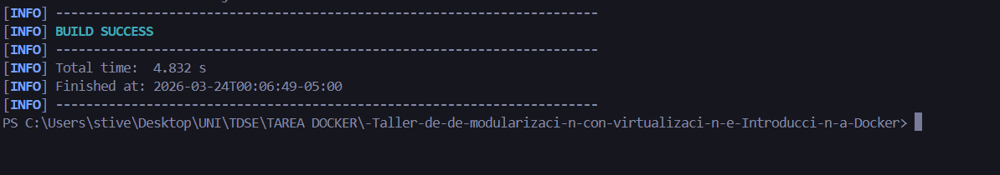


### 2. Construir la imagen Docker
```bash
docker build --tag customwebserver .
```
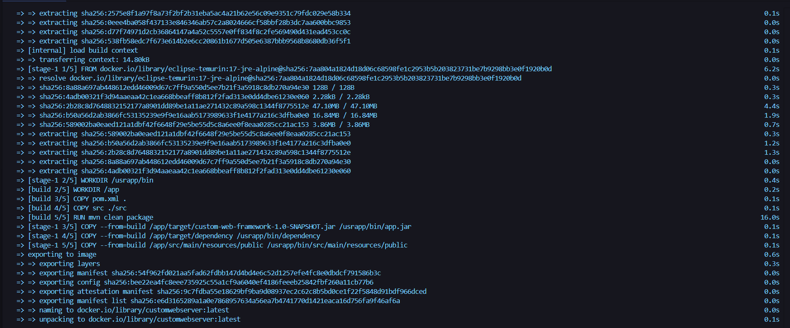

### 3. Correr 3 instancias del contenedor
```bash
docker run -d -p 34000:6000 --name webserver1 customwebserver
docker run -d -p 34001:6000 --name webserver2 customwebserver
docker run -d -p 34002:6000 --name webserver3 customwebserver
```
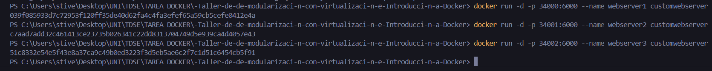

Verificar imágenes y contenedores corriendo:
```bash
docker images
docker ps
```
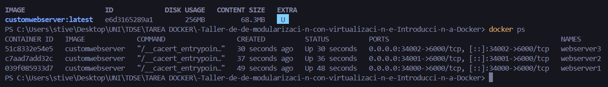

Accede a:
* `http://localhost:34000/greeting?name=User`
* `http://localhost:34001/greeting?name=User`
* `http://localhost:34002/greeting?name=User`


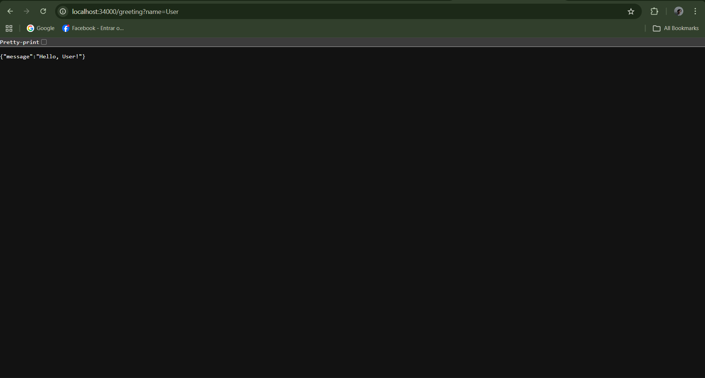
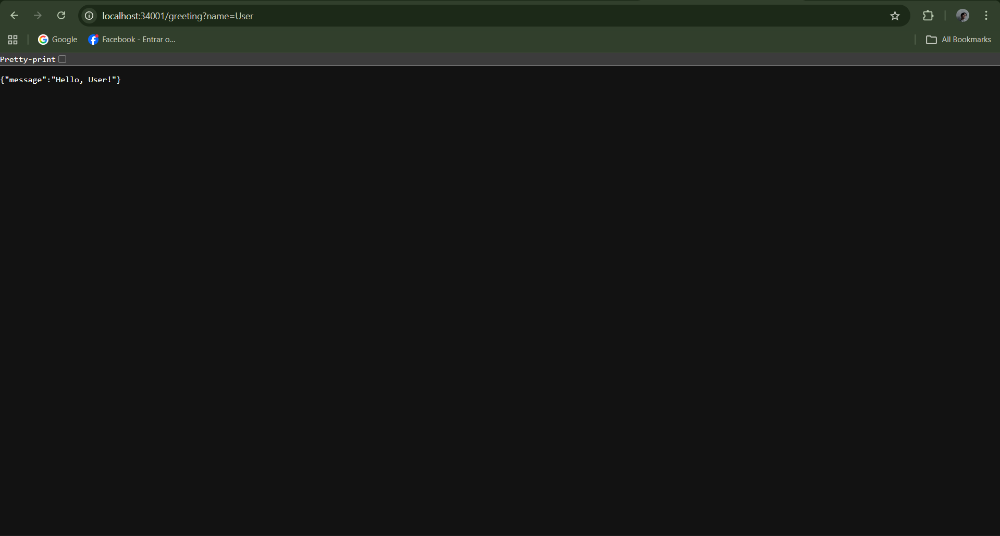
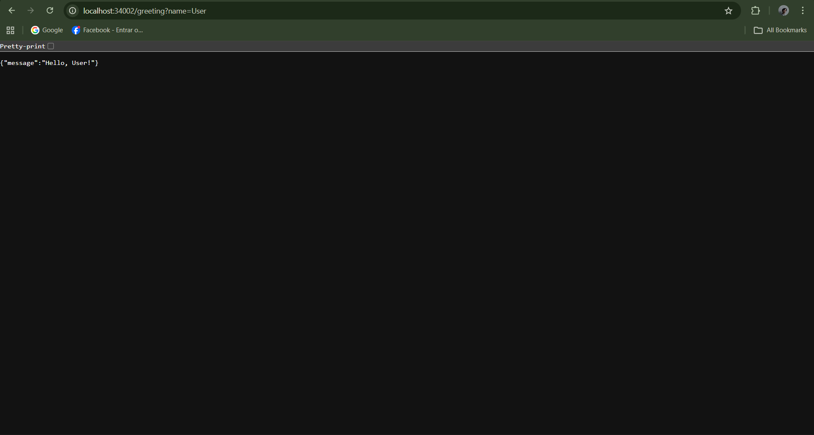


### 4. Docker Compose
```bash
docker-compose up -d
```
Accede al servicio web en: `http://localhost:8087/greeting`
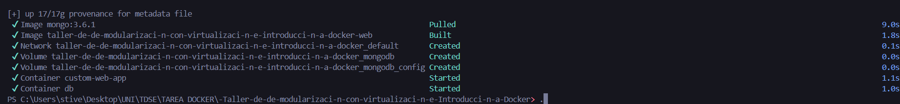
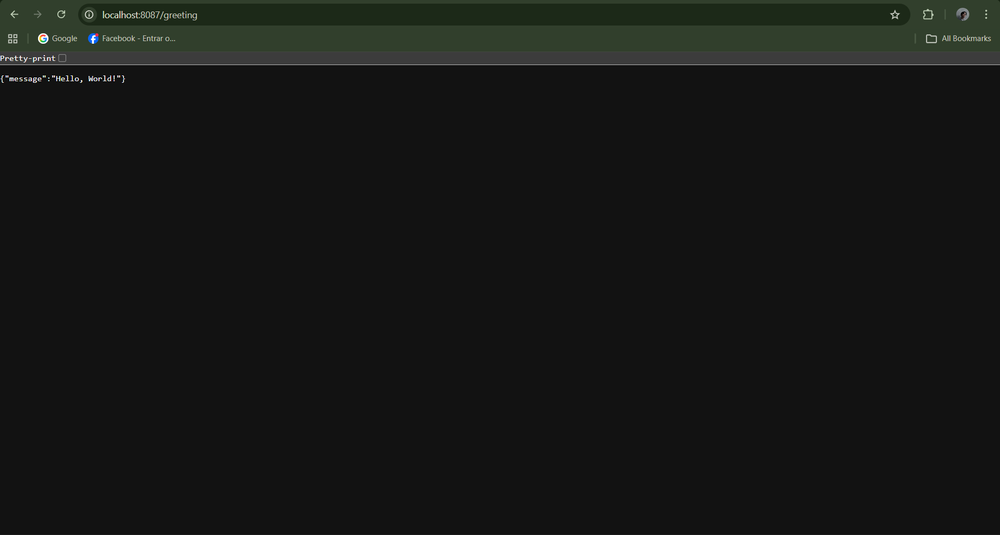


## Publicación en Docker Hub

### 1. Etiquetar y subir la imagen
```bash
docker tag customwebserver usuario/customwebserver:latest
docker login
docker push usuario/customwebserver:latest
```
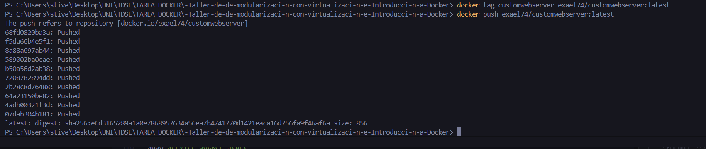


### 2. Repositorio publicado en Docker Hub con el tag latest

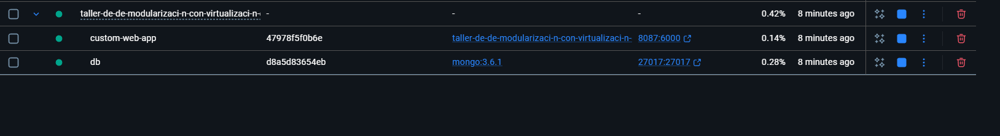

La imagen queda disponible públicamente. Para correrla desde cualquier máquina:
```bash
docker pull tu_usuario/customwebserver:latest
docker run -d -p 42000:6000 tu_usuario/customwebserver:latest
```
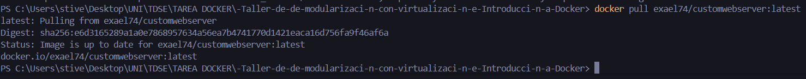
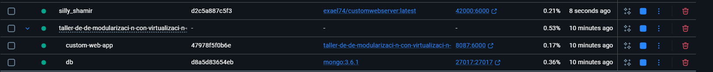

## Despliegue en AWS EC2

### 1. Lanzar instancia EC2
Se crea una instancia EC2 con Amazon Linux 2023, tipo t2.micro.
*(Imagen: EC2 Instance Running)*

### 2. Instalar y habilitar Docker en la instancia
```bash
sudo yum update -y
sudo yum install docker -y
sudo service docker start
sudo usermod -a -G docker ec2-user
```
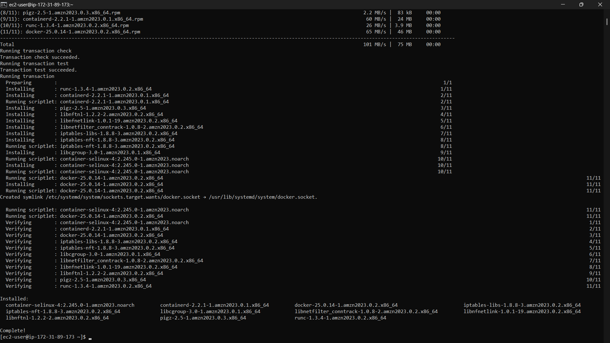
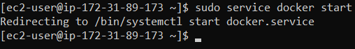

### 3. Ejecutar la imagen desde Docker Hub
```bash
docker run -d --name customdockeraws -p 42000:6000 tu_usuario/customwebserver:latest
```
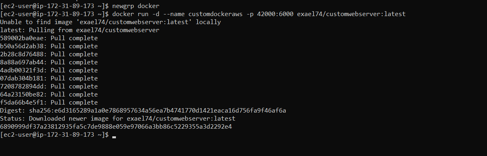

### 4. Configurar Security Group (Inbound Rules)
Agregar una regla de entrada:
* **Type**: Custom TCP
* **Port range**: 42000
* **Source**: 0.0.0.0/0

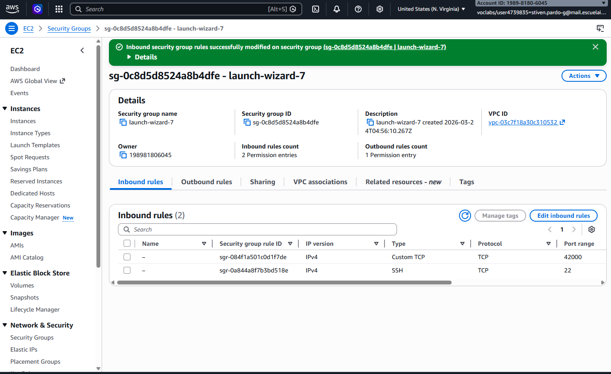

### 5. Verificar acceso público
Con la instancia en ejecución, Docker activo y la regla inbound configurada, la aplicación queda accesible desde:
`http://ec2-XXX.compute-1.amazonaws.com:42000/greeting?name=User` (http://ec2-3-87-64-143.compute-1.amazonaws.com:42000/greeting?name=User
)

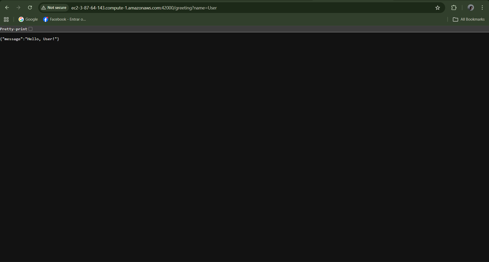

## Requisitos Técnicos

### Soporte de solicitudes concurrentes
El servidor procesa conexiones de manera concurrente mediante un pool de hilos fijo (`ThreadPoolExecutor`), permitiendo atender múltiples clientes al mismo tiempo sin bloquear el ciclo principal de aceptación de sockets.

### Apagado elegante (graceful shutdown)
Se implementa un hook de runtime (`Runtime.getRuntime().addShutdownHook(...)`) que:
* Cierra el `ServerSocket` de forma controlada.
* Detiene el pool de workers esperando su finalización (`awaitTermination`) y forzando cierre si es necesario.

## Evidencia de Pruebas Automatizadas
Comando ejecutado:
```bash
mvn test
```
Resultado:
```text
Tests run: 0, Failures: 0, Errors: 0, Skipped: 0
BUILD SUCCESS
```

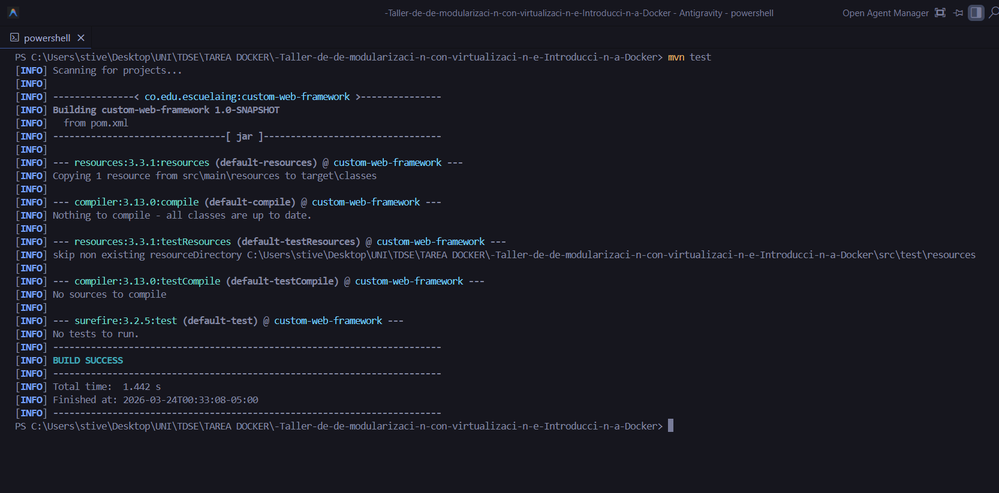

## Estructura del Proyecto
```text
custom-web-framework/
├── src/
│   └── main/
│       ├── java/
│       │   └── co/edu/escuelaing/
│       │       ├── app/
│       │       │   └── Main.java
│       │       └── framework/
│       │           ├── HttpServer.java
│       │           ├── Request.java
│       │           ├── Response.java
│       │           ├── RouteHandler.java
│       │           └── Router.java
│       └── resources/
│           └── public/
│               └── index.html
├── images/
├── Dockerfile
├── docker-compose.yml
├── pom.xml
└── README.md
```
